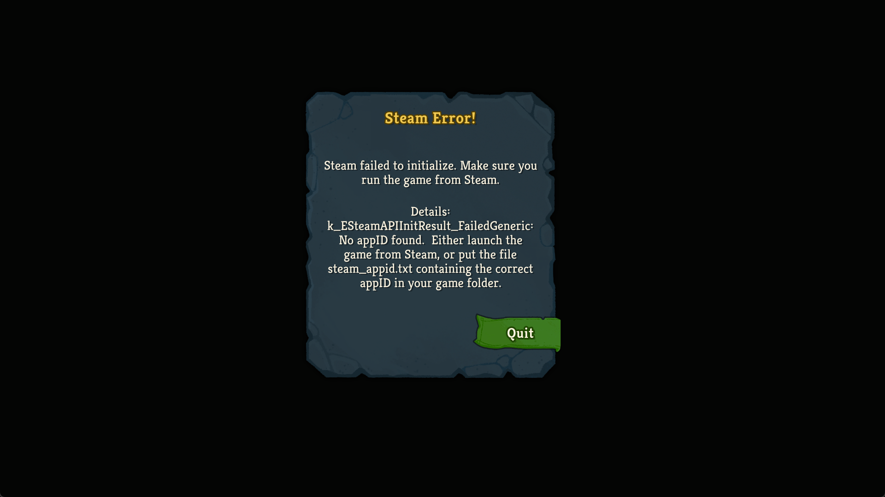
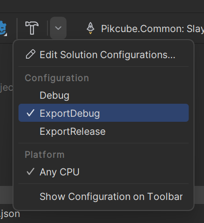
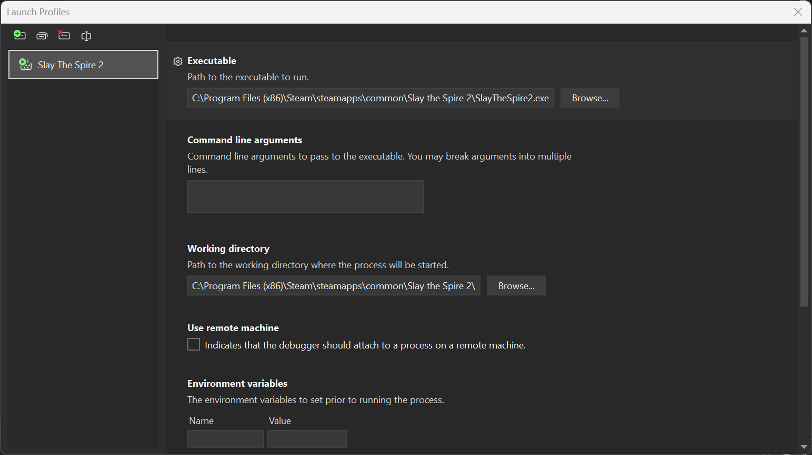
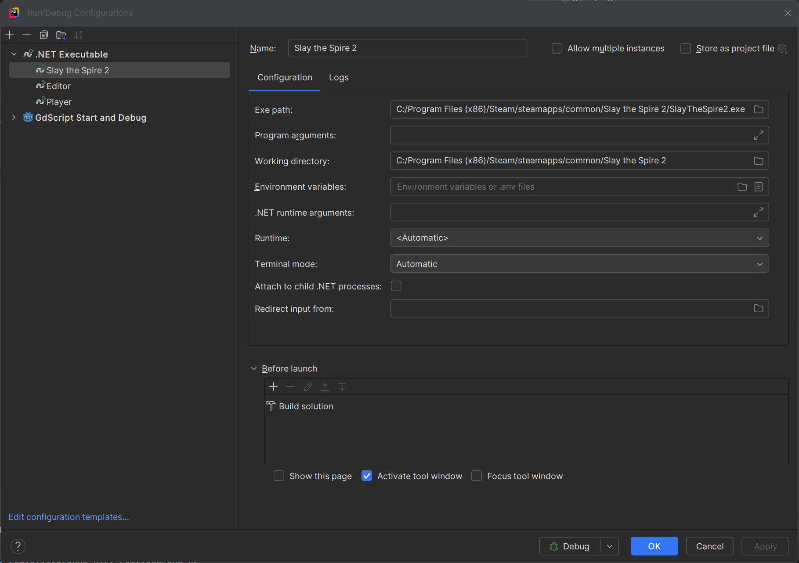
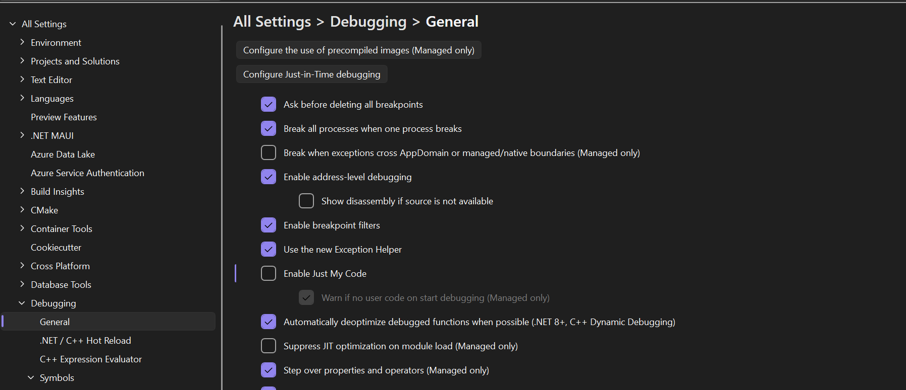
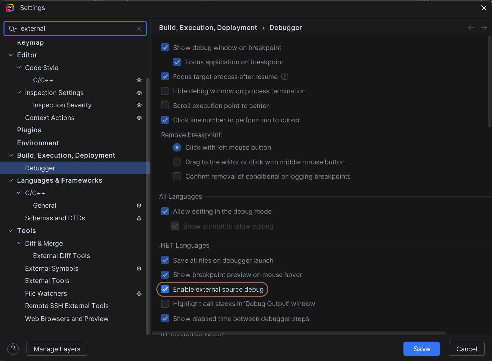

# Setting up the Debugger with Slay the Spire 2

Setting up a debugger allows you to set breakpoints in your code and step through execution line by line. The process isn't difficult if a bit annoying.

## Preparing the Slay the Spire 2 Executable for Debugging (Once Per Machine)

In order to use a debugger, we're going to need to be able to launch Slay the Spire. Unfortunately, going into Steam and right clicking Slay the Spire 2 -> Manage -> Browse Local Files, then double clicking `SlayTheSpire2.exe` gives us this wonderful error message.



This is thankfully a pretty easy fix, you just need to create a text file called `steam_appid.txt` in the game directory and set the contents to `2868840`.

Thankfully, you only need to do this step once, and it'll work forever (unless you delete the file I suppose).

## Setting up the Debugger (Once Per Project)

Actually setting up the debugger is pretty straight forward once you can launch the game at all. Slay the Spire 2 was made in Godot 4, which supports debuggers out of the box.

At a high level, you need to
1. Compile your mod for `Debug` (with Optimizations Off)
2. Set the Launch Profile to launch Slay the Spire 2

### Compiling without Optimizations

If you are using [Alchyr Mod Template](https://github.com/Alchyr/ModTemplate-StS2/tree/master), this is as easy as setting your build configuration to either `Debug` or `ExportDebug` (and if you aren't using their template you probably already know how to do this).



***Do not compile using `ExportRelease` when debugging. Enabling compiler optimizations (which Release builds do) interferes with the ability to use break points.***

### Setting the Launch Profile

For this, you'll need to know where your game is installed, which you found earlier by going into Steam and right clicking Slay the Spire 2 -> Manage -> Browse Local Files.

If you are comfortable messing with your project files directly, you can just create a file in `Properties/launchSettings.json` with the following content

```json  
{
  "profiles": {
    "Slay The Spire 2": {
      "commandName": "Executable",
      "executablePath": "<PATH TO STS2 HERE>",
      "workingDirectory": "<PATH TO STS2 GAME DIRECTORY HERE>"
    }
  }
}
```

If you are using windows, it probably looks like this
```json  
{
  "profiles": {
    "Slay The Spire 2": {
      "commandName": "Executable",
      "executablePath": "C:\\Program Files (x86)\\Steam\\steamapps\\common\\Slay the Spire 2\\SlayTheSpire2.exe",
      "workingDirectory": "C:\\Program Files (x86)\\Steam\\steamapps\\common\\Slay the Spire 2\\"
    }
  }
}  
```  

You can also fill this out within your IDE. In Visual Studio, go to Menu > Debug > Debug Properties and fill out the Executable and Working Directory.



In Rider, go to Run / Debug Configuration > Edit Configurations. Click Add New Configuration (+) > .Net Executable, and fill out the Executable and Working Directory. Then click Okay.



## Launching the Game

The hard part is all finished, now all you have to do is build you project then launch the debugger with your new configuration (F5 in Visual Studio, Alt+F5 in Rider).

## Enabling External Source Debugging

Stepping through your code is helpful by itself, but it's even more helpful to be able to step through the code in BaseLib or Slay the Spire 2 itself.

This might already be enable for you, but if it isn't you can enable it in your debugger settings.

In Visual Studio, go into Menu > Tools > Options > Debugging > General, and Disable `Enable Just My Code`



In Rider, go to Settings > Build, Execution, Deployment > Debugger > .Net Languages, and enable `Enable exteranl source debug`



# Special Thanks

I want to quickly give a shout out to [this reddit post](https://www.reddit.com/r/godot/comments/xhirp8/debugging_godot4_beta_projects_from_vs_and_vscode/) by `u/PeppySeppy`. Their guide was the jumping off point I used to figure everything out.
